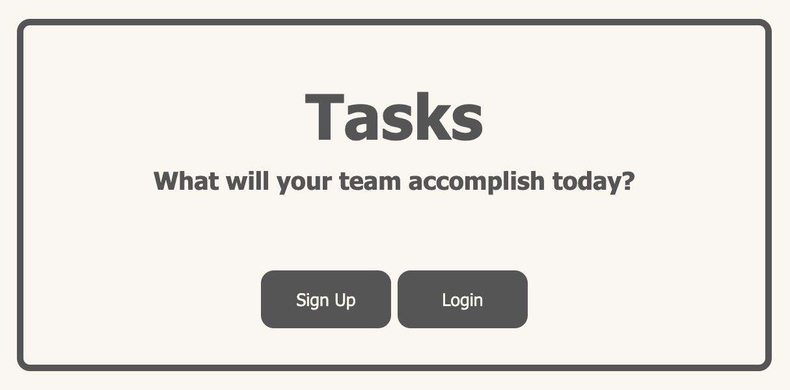
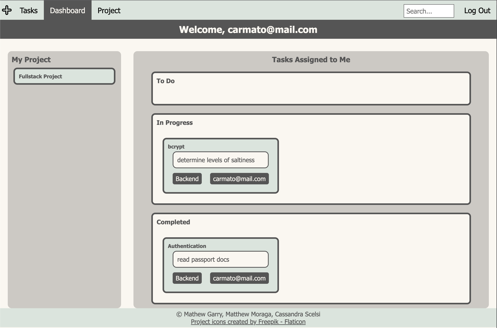
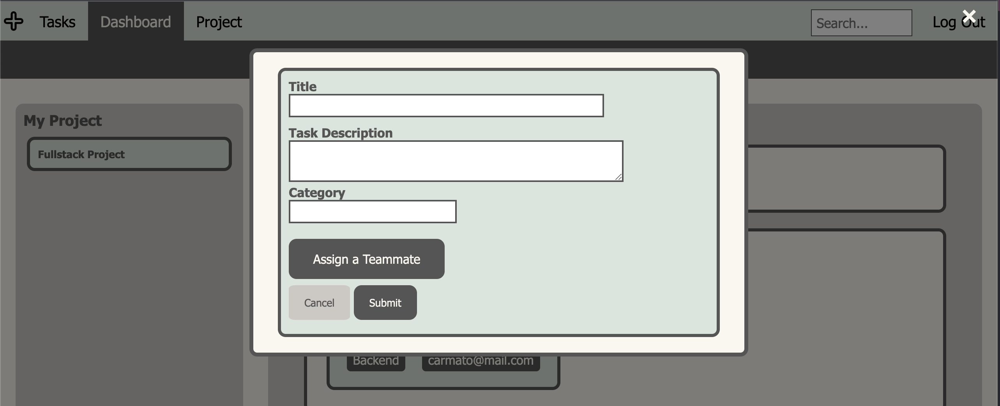
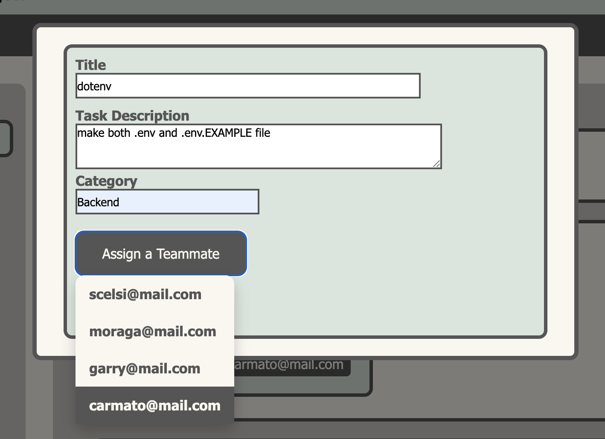
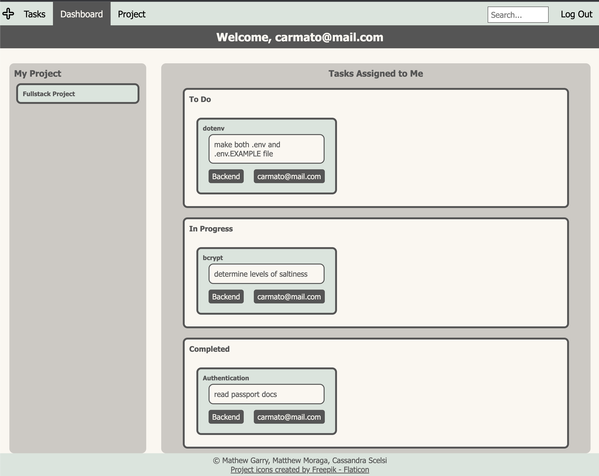

# Tasks
	A comprehensive group task management application that will become the only task management web application you'll ever want to work with. We've aimed to make this application simple and accessible while not compromising on power, functionality, and security.

## Description

Tasks is a project management app for students working on group projects. Tasks uses cards to visually display the flow of the project. A user can view all the tasks assigned to them by status or they can view all of the tasks in the project by status. This application was developed using Node.js with a mysql database, and an express server for backend tasks. This application was developed using the handlebars NPM framework, and CSS, along with Browser JavaScript for the frontend of the application. 

## Installation 
	The installation process for this application is extremely simple. The only prerequisites needed are a web browser and a site login which is illustrated how to create below in usage.

## Usage

Register or login

View your dashboard.

Click the + to add a task.

Enter task data into the card.

Dashboard populates with new data.

<!-- Project page displays all tasks for the project. -->

## Credits

- https://www.w3schools.com/howto/howto_css_animated_search.asp 
- https://www.w3schools.com/howto/howto_css_fixed_menu.asp
- https://www.flaticon.com/free-icon/plus_10349320?term=plus+sign&page=1&position=16&origin=search&related_id=10349320 
- https://colorhunt.co/palette/d9e4ddfbf7f0cdc9c3555555
- https://css-tricks.com/snippets/css/a-guide-to-flexbox/
- https://www.w3schools.com/howto/howto_css_badge.asp
- https://www.w3schools.com/howto/howto_css_login_form.asp
- https://gridbyexample.com/examples/example13/ 
- https://www.passportjs.org/tutorials/password/signup/
- https://www.passportjs.org/howtos/password/
- https://dev.mysql.com/doc/refman/8.0/en/mysql-batch-commands.html
- https://gm456742.github.io/PassportJS_Auth_Tutorial/
- https://bigboxcode.com/mysql-error-1045-access-denied-for-user
- https://sequelize.org/docs/v6/getting-started/
- https://www.passportjs.org/packages/passport-local/
- https://medium.com/@darrand37/migrations-and-seeding-made-easy-in-node-js-using-sequelize-80bd13620b45
- https://fig.io/manual/sequelize/db:seed:undo

## Packages and Dependencies 
- Node.js
- NPM dependencies: 
		"axios": "^1.3.5",
    "bcrypt": "^5.1.0",
    "bcryptjs": "^2.4.3",
    "dotenv": "^16.0.3",
    "express": "^4.18.2",
    "express-handlebars": "^7.0.7",
    "express-session": "^1.17.3",
    "handlebars": "^4.7.7",
    "mysql2": "^3.2.3",
    "nodemon": "^2.0.22",
    "passport": "^0.6.0",
    "passport-local": "^1.0.0",
    "sequelize": "^6.31.0",
    "y": "^0.3.2"
- https://insomnia.rest/
- mysql database 
- github.com
- GitGuradian Security Checks 
- security/snyk 

## Contributers
- Matthew Gary: https://github.com/mhgarry (backend, creative development, development, architecture, seeding, models, server, database, eslint airbnb styling, security, passport authentication)
- Matthew Moraga: https://github.com/MatthewMoraga (backend,creative development, development, architecture, models, routing, authentication, security, backend and frontend routing, passport authentication)
- Cassandra Scelsi: https://github.com/scelsic2 (frontend, development, creative development, 
architecture, models, post routing, front end JS, CSS, HTML/HBS using handlebars framework, main client side web design and UI/UX)

## License

MIT License

## Deployed Application Link

Paste your deployed application link here.

---
